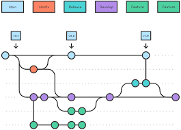
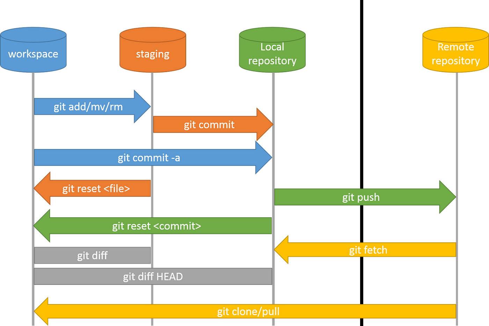

# Github Project Assignment 1
## Workings of Git on a high level
- There are two main version control systems, Centralized and Distributed. A centralized version control system is where all the versions are stored in one central server, where as a distributed version control system stores a full history of all the versions in each user's local machine. Git is a good example of a distributed version control system.

- Git snapshots are git documenting what state your files are in at a specific point in time. Each time you commit your files to Git, it takes a snapshot of the files and decides wether or not they have been changed, new files have been added, files deleted, or files stayed the same since the last snapshot. This is how versioning can stay organized, by using snapshots!

- A Git repository is a file store of all the files in your Git project. A local repository is copy of your project stored on your local machine, where a remote repository is all of the files stored in a server like GitHub.

- A Git commit is when you commit your files to a new version, or snapshot. Every time you do a Git commit is like adding a checkpoint in your code that you can go back to and start over or look at the history of your code in that point in time.

- A working directory is the project files you are currently working on in a repository.

- A staging area is where you select the files that you want to be included in the next commit. This way you can only choose files that you are finished working on and avoid committing files that are still in development.

- See the following diagram for an example workflow in Git.

     

    Reference: https://www.atlassian.com/git/tutorials/comparing-workflows/gitflow-workflow

- See the following diagram that shows the Git architecture:

    

    Reference: https://medium.com/@mehulgala77/git-fundamentals-history-architecture-popular-commands-1d3cd8bc1049