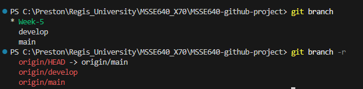
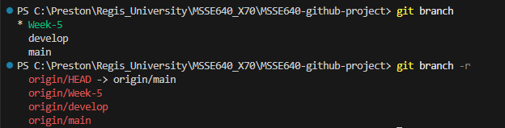
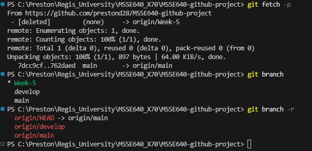

# Github Project Assignment 4
## Git branches

Created a week 5 feature branch using VS code's UI. Here are the local and remote branches now:



After committing some changes I made (including the new branch), here is the difference between local and remote branches:



After merging my week 5 branch and deleting it from my remote repo, I did:

```
git fetch -p
```

My local machine then realized the remote branch was deleted, but my local branch still remained:



This is because "git fetch -p", in the words of Github Copilot, "only removes references to remote branches that have been deleted from the remote repository. It does not delete your local branch."