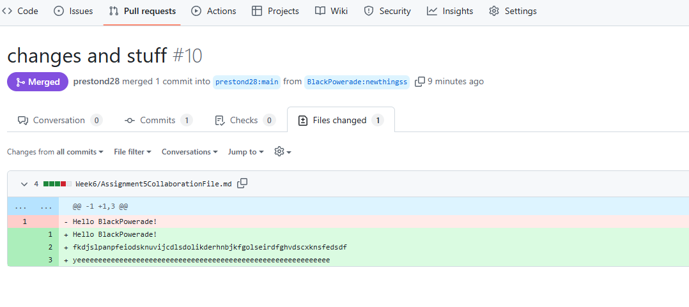
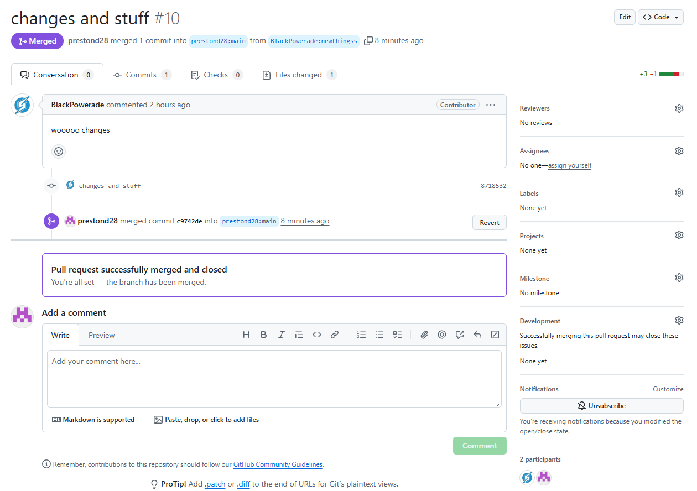

# Github Project Assignment 5
## Collaboration

It was cool to see how to actually collaborate with someone this week in Github and see how everything works when it's not just yourself working on a file! Here were our results:

